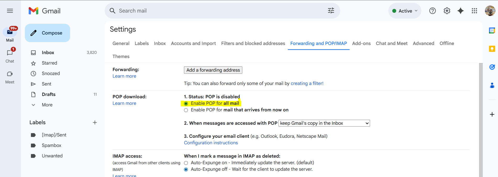
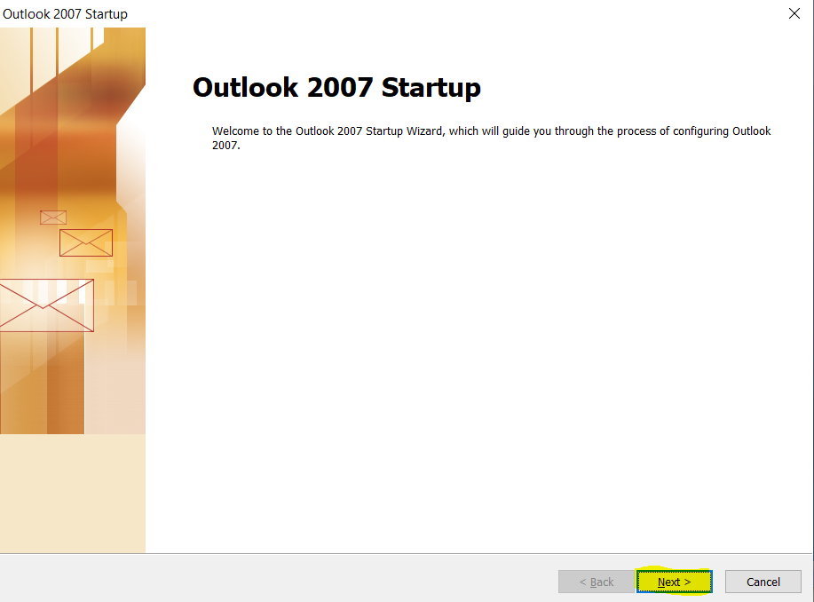
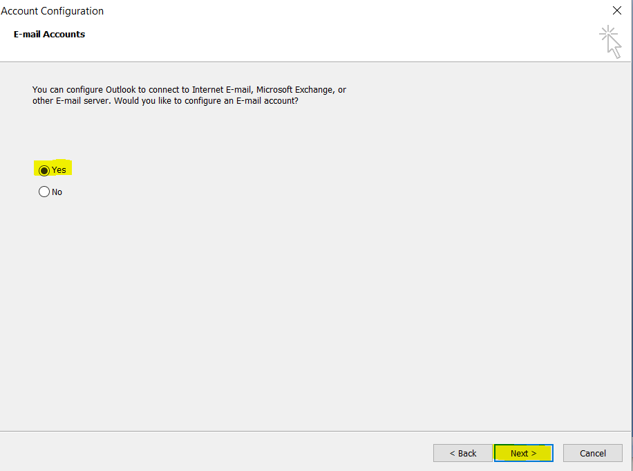
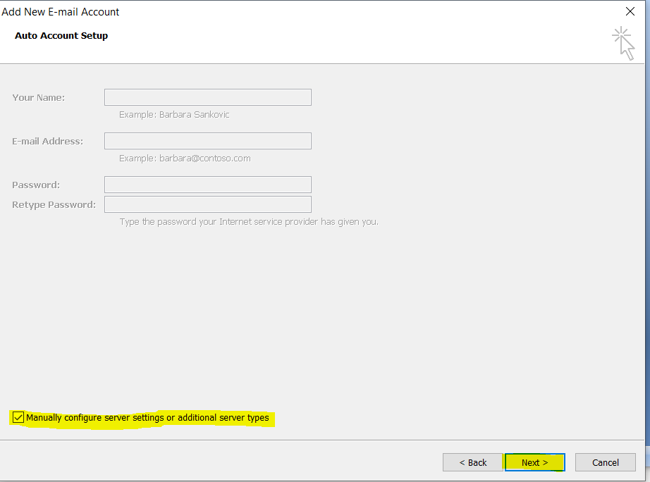
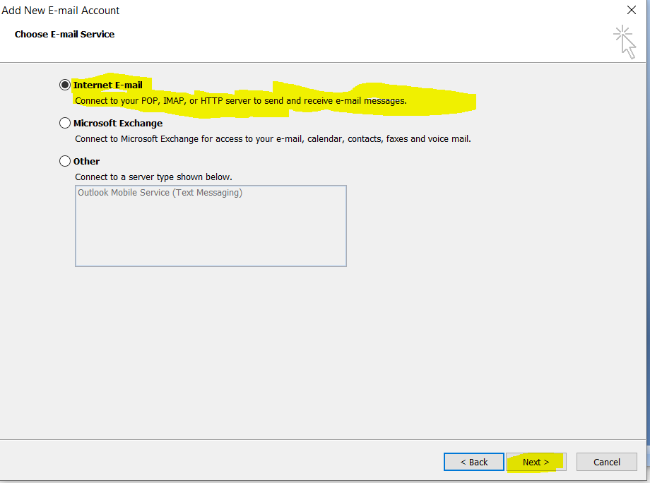
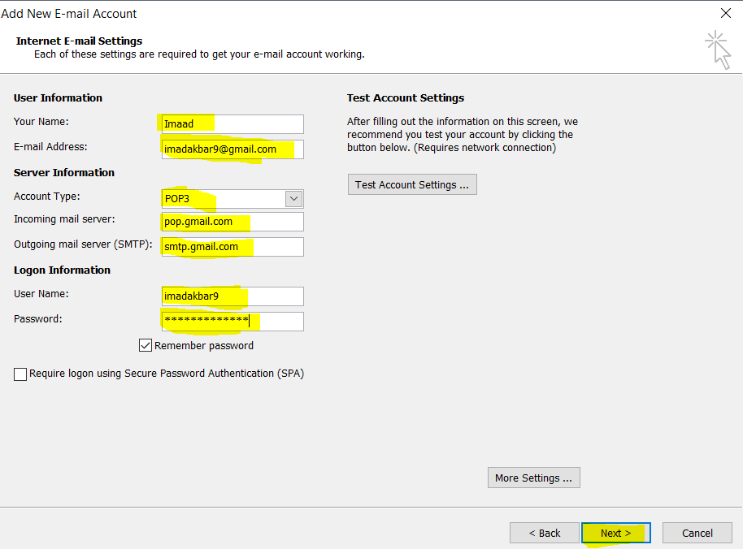
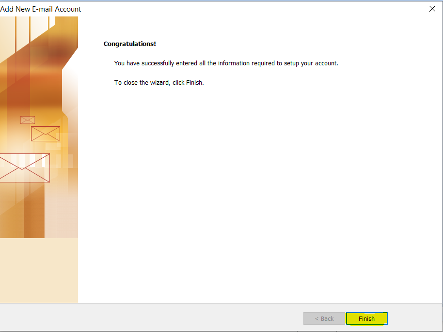
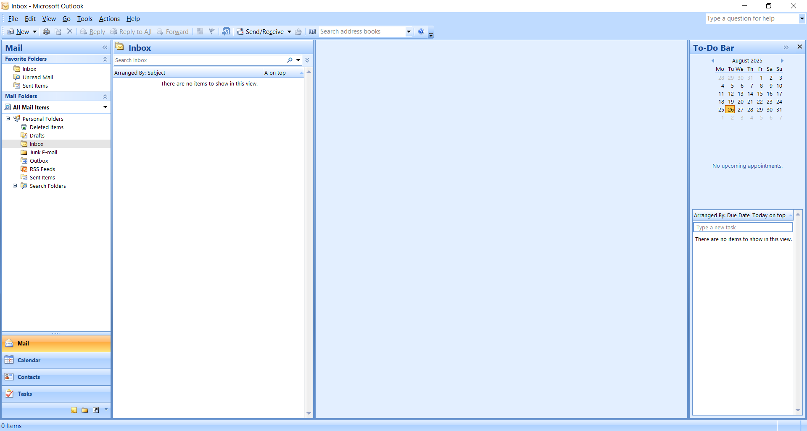

# Configure-Outlook

🔹 Overview

This project demonstrates how to configure Microsoft Outlook for email communication. It shows the step-by-step process of setting up an Outlook account with proper server settings (IMAP/POP and SMTP).

🔹 Features

Configure Outlook with custom mail server

Send and receive emails directly via Outlook

Secure login with authentication

Support for both IMAP and POP

🔹 Steps Performed

Installed and launched Microsoft Outlook

Added a new email account

Entered incoming (IMAP/POP) and outgoing (SMTP) server details

Configured ports and encryption (SSL/TLS)

Tested account by sending & receiving emails

🔹 Use Case

This project can be useful for:

Learning how to set up email clients

Organizations that want employees to use Outlook with their custom domain

Troubleshooting email connectivity issues

# Steps

1. Open Gmail Settings, go to the Forwarding and POP/IMAP tab, and enable POP for all mail.

   

2. Open outlook

   

3. Select Yes and click Next.

   

4. Select “Manually configure server settings or additional server types”.

      

5. Select the “Internet E-mail” option. ✅

      

6. Fill in your account information and click Next. ✅

      

7. Click on finish

      

8. Your Outlook account is now successfully configured. ✅

      

